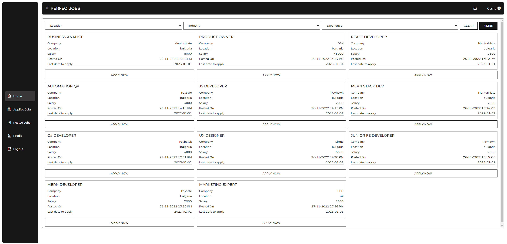

<h1 align="center"><i>PERFECTJOBS-LITE</i></h1>

**_
Perfectjobs-lite is a job portl application. It was developed during a course in Udemy. The project was built with React, ANTD and Firebase.
_**

  <a href="https://perfectjobs-lite.netlify.app/">
    
    

    
    

    
    

    
    

    
    

    
    

    
    

  </a>

    

  
  __Certificates__
  
   

   

  <a href="https://udemy-certificate.s3.amazonaws.com/image/UC-5b6094fc-2177-4cd2-aaeb-6c996791d48e.jpg?v=1669569109000">
    
    

  </a>

  

  
  __Features__
  
   

  - <i><b>Home page</b></i>
  - <i><b>Auth (Register, Login)</b></i>
  - <i><b>Type of users (Admin and Standard user)</b></i>
  - <i><b>Update user profile</b></i>
  - <i><b>Create job post (user only)</b></i>
  - <i><b>Update job post (owner only)</b></i>
  - <i><b>Approve job post (admin)</b></i>
  - <i><b>Apply for job (user different from the post owner))</b></i>
  - <i><b>Approve/Reject job application (post owner))</b></i>
  - <i><b>Notifications when new job post created (admin)</b></i>
  - <i><b>Notifications when job post is approved/rejected (post owner)</b></i>
  - <i><b>Notifications when user applying for job post (post owner)</b></i>
  - <i><b>Notifications when job application is approved/rejcected (applied user)</b></i>

  

<h2>Hosted at <a href="https://perfectjobs-lite.netlify.app/" />https://perfectjobs-lite.netlify.app/</h2>

<h3>Admin credentials</h3>

username: admin@abv.bg

password: 123456

